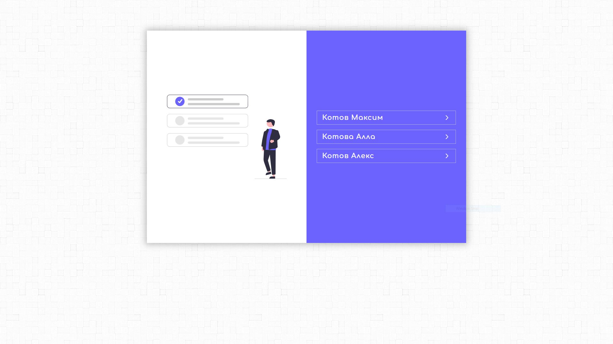
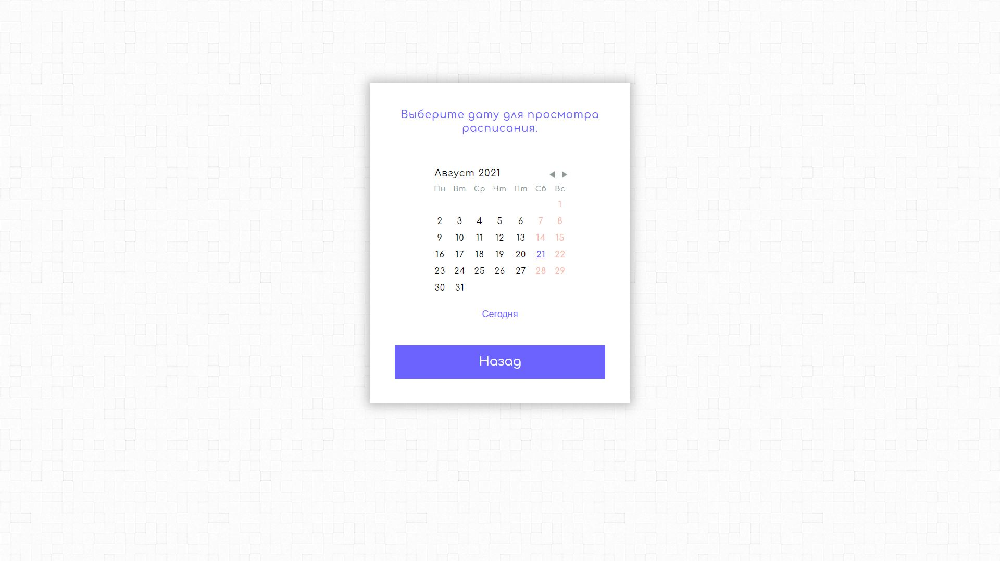
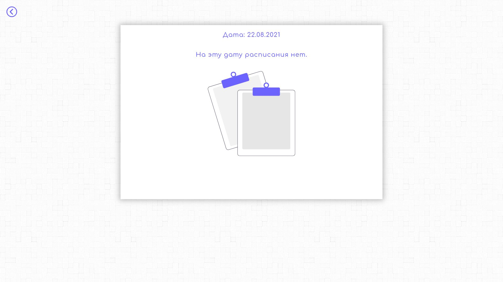

# Timetable for students.

**Teachers**

**Calendar**

**Timetable**

**Timetable**

**Demo**

To install und run the project:

 ### `1. npm install`
 ### `2. npm start`

(Please check the back-end part: [https://github.com/VolodymyrVoronov/music-school-timetable-back](https://github.com/VolodymyrVoronov/music-school-timetable-back))

(Please check the front-end part for teachers: [https://github.com/VolodymyrVoronov/music-school-timetable-teacher-front](https://github.com/VolodymyrVoronov/music-school-timetable-teacher-front))

*DISCLAIMER:*
Please note, this project is for demonstration purpose only.